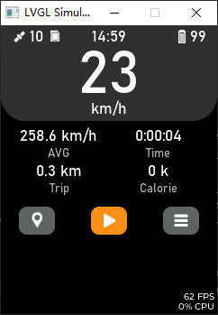
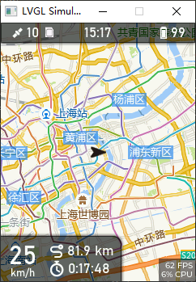

# X-TRACK模拟器

## 项目说明

使用Cmake工具链的X-TRACK模拟器，无需安装visual studio，可以使用Clion或vs code开发，方便学习X-TRACK的源码或二次开发。

## 如何使用

windows系统，安装cmake和mingw64。本项目使用了lvgl官方仓库作为子模块，克隆本项目到本地后，首先安装lvgl和lv_drvers子模块：

```shell

git submodule update --init --recursive

```

在本项目同级目录新建一个SDCARD目录作为模拟SD卡的路径，放入地图文件，地图目录为MAP，地图下载教程：

https://github.com/FASTSHIFT/X-TRACK/blob/main/Tools/README.md

SD_CARD放入一个TRK_EXAMPLE.gpx轨迹文件作为模拟轨迹路径。

使用camke build后运行即可。

运行截图：

<div align="center">

</div>


本项目使用了官方推荐的模拟器[lv_port_win_codeblocks](https://github.com/lvgl/lv_port_win_codeblocks)(win32drv)作为框架，然后使用了[lv_port_pc_eclipse](https://github.com/lvgl/lv_port_pc_eclipse)(sdl_drv)的CMakeLists.txt并做了一些修改，然后引入X-TRACK的源码，再次修改CMakeLists.txt解决一些依赖报错后才得以成功运行。基于我这个思路，你也可以把它移植到其他平台的模拟器上。
